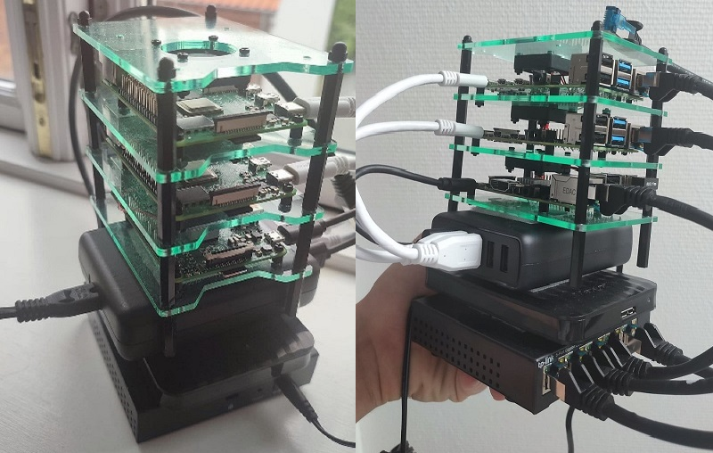

# Intro



# Table of content

- [Architecture](#Architecture)
- [Hardware](#Hardware)
- [Software](#Software)
- [Deployments](#Deployments)
- [Setup](#Setup)
- [Project Future](#Project-Future)
- [References](#References)

# Architecture

The Architecture consist of 3 servers:

1. Node 1 - Master Node - Manages the worker nodes and the Pods in the cluster.
2. Node 2 - Worker Node - Contains deployments, pods and CronJobs
3. Node 3 - Contains MariaDB database that is used by deployments in the K8 cluster. This node also contains: Nextcloud
   instance and NFS server that exposes storage of HDD disk to the other two nodes.


# Hardware

## Raspberry PI

The Raspberry Pi is a low cost, credit-card sized computer that plugs into a computer monitor or TV, and uses a standard
keyboard and mouse. It is a capable little device that enables people of all ages to explore computing, and to learn how
to program in languages like Scratch and Python. It’s capable of doing everything you’d expect a desktop computer to do,
from browsing the internet and playing high-definition video, to making spreadsheets, word-processing, and playing
games.


Two different PIs versions has been used:

1. 2x Raspberry PI 4B - 8 GB RAM - 1,5 GHz Quad-Core ARM-Cortex A72 CPU
2. 1x Raspberry PI 2B - 2 GB RAM - 900 MHz Quad-Core 2ARM Cortex-A7

## HDD Storage

External HDD disk is part of the cluster to ensure memory resources are sufficient. The HDD disk size is 1 TB and is
attached to the third Raspberry PI that exposes the disk to the other two nodes via NFS protocol. Disk is also used for
storage of the database data and NextCloud instance data (stateful applications).

## Ethernet switch

The TL-SG105E 5-Port Gigabit Easy Smart switch is designed specifically for small and medium networks that require
simple network management and basic features.


[comment]: <> (Brand, specs, capacity, price)

## WiFi Router

TL-MR6400 is a 300 Mbps Wireless N 4G LTE Router that shares internet access with up to 32 WiFi devices while providing
download speeds of up to 150 Mbps.


## Power supply

It is important to choose high quality and powerful power adapter + cables to fulfil Rasbperry' power supply
requirements. The Raspberry PIs can be supplied by power in two ways:

1. Classic cables + Power Supply
2. POE - Power of Ethernet (Special ethernet switch can be used that provider power via Ethernet and POE hat on
   raspberry)

Because POE can be very expensive, it was decided to us classic cables and a power supply.

Anker is an America's leading USB charging brand that powers 20 million+ devices. Anker PowerPort 63W uses Qualcomm
Quick Charge 3.0 combines with Anker's proprietary PowerIQ and VoltageBoost to deliver the fastest possible charge to
almost any USB device. The charger has 5 ports that pump out 63W of power—enough for the whole family to simultaneously
charge multiple devices at the highest speed possible. Due to quality, it was decided to use this charger. The price of
it varies - starting from 35 to 50 eur.


## Cables

Two main cable types has been used in the cluster:

1. Ethernet cables - 3x Goobay CAT 6a SFTP - 25 cm - 1,5 eur each
2. Power supply cables - 3x Goobay USB 3.0 Type C - 20 cm - 3 eur each

## Cluster Case

Cluster case has been used to bundle all the parts of the cluster together. The case itself holds 3 Raspberry PIs and
has a fans that keep the PIs cooled down (external heat sinks are also added on the chips). Rest of the components (
power supply, HDD, ethernet switch) can be added/stick as a modules to the cluster case via velcro.


# Software

## Kubernetes Distribution

### Options

There are many distributions that makes creation of Kubernetes clusters easy:

* MicroK8s - MicroK8s is a low-ops, minimal production Kubernetes, for devs, cloud, clusters, workstations, Edge and
  IoT. It was only supporting a single node but recently they added clustering.
* k3s - K3s is a certified Kubernetes distribution built for IoT & Edge computing. It’s very lightweight and is
  optimized for ARM, both arm64 and armv7. K3s replaces a few components used by traditional K8s cluster. Particularly,
  etcd is replaced with sqlite3 for state management and etc.
* KIND - Kind is a tool for running local Kubernetes clusters using Docker container “nodes”. Kind was primarily
  designed for testing Kubernetes itself, but may be used for local development or CI.
* k3d - k3d is a lightweight wrapper to run k3s in docker. k3d makes it quite easy to create single- and multi-node k3s
  clusters in docker, e.g. for local development on Kubernetes.
* k0s - Is an all-inclusive Kubernetes distribution with all the required bells and whistles preconfigured to make
  building a Kubernetes clusters a matter of just copying an executable to every host and running it.

### K3s

K3s has been chosen as a distribution for the cluster due to it's strong developer community, ease of setup and due to
the big number of tutorials for this technology. It is a lightweight Kubernetes distribution created by Rancher Labs,
and it is fully certified by the Cloud Native Computing Foundation (CNCF). K3s is highly available and production-ready.
It has a very small binary size and very low resource requirements.

In simple terms, K3s is Kubernetes with bloat stripped out and a different backing datastore. That said, it is important
to note that K3s is not a fork, as it doesn't change any of the core Kubernetes functionalities and remains close to
stock Kubernetes.

### Components

Bundles following technologies to single distribution:

* [Containerd](https://containerd.io/) & [runc](https://github.com/opencontainers/runc)
* [Flannel](https://github.com/coreos/flannel) for CNI
* [CoreDNS](https://coredns.io/)
* [Metrics Server](https://github.com/kubernetes-sigs/metrics-server)
* [Traefik](https://containo.us/traefik/) for ingress
* [Klipper-lb](https://github.com/k3s-io/klipper-lb) as an embedded service load balancer provider
* [Kube-router](https://www.kube-router.io/) netpol controller for network policy
* [Helm-controller](https://github.com/k3s-io/helm-controller) to allow for CRD-driven deployment of helm manifests
* [Kine](https://github.com/k3s-io/kine) as a datastore shim that allows etcd to be replaced with other databases
* [Local-path-provisioner](https://github.com/rancher/local-path-provisioner) for provisioning volumes using local
  storage
* [Host utilities](https://github.com/k3s-io/k3s-root) such as iptables/nftables, ebtables, ethtool, & socat

Website: [K3S Official Website](https://rancher.com/docs/k3s/latest/en/)


## Ansible

Ansible is a radically simple IT automation system. It handles configuration management, application deployment, cloud
provisioning, ad-hoc task execution, network automation, and multi-node orchestration. Ansible makes complex changes
like zero-downtime rolling updates with load balancers easy.

The technology has been used for the automation of the initial cluster setup. There are few prerequisites for the k3s
Ansible playbook to work:

1. The playbook has updated IP addresses of the Kubernetes nodes.
2. The PC executing Ansible should have access to each node.
3. The access should be password-less (Either not use password at all or use Public and Private Keys)
4. In case of the Public and Private key authentication, the SSH fingerprints needs to be accepted beforehand

Reference to the playbook: [Ansible k3s Playbook](https://github.com/k3s-io/k3s-ansible)


## Terraform

Terraform is a tool for building, changing, and versioning infrastructure safely and efficiently. Terraform can manage
existing and popular service providers as well as custom in-house solutions.

The key features of Terraform are:

* Infrastructure as Code: Infrastructure is described using a high-level configuration syntax. This allows a blueprint
  of your datacenter to be versioned and treated as you would any other code. Additionally, infrastructure can be shared
  and re-used.
* Execution Plans: Terraform has a "planning" step where it generates an execution plan. The execution plan shows what
  Terraform will do when you call apply. This lets you avoid any surprises when Terraform manipulates infrastructure.
* Resource Graph: Terraform builds a graph of all your resources, and parallelizes the creation and modification of any
  non-dependent resources. Because of this, Terraform builds infrastructure as efficiently as possible, and operators
  get insight into dependencies in their infrastructure.
* Change Automation: Complex change sets can be applied to your infrastructure with minimal human interaction. With the
  previously mentioned execution plan and resource graph, you know exactly what Terraform will change and in what order,
  avoiding many possible human errors.

Terraform modules developed for the
project: [Terraform Modules](https://github.com/tomondre/raspberry-kubernetes-cluster/tree/master/terraform-modules)

### Reusable Modules

Terraform has been used in the project to automate provisioning of Kubernetes resources in the cluster. Due to this
reason, a reusable Terraform module has been developed in order to standardise and speed up Kubernetes deployments. The
following code snippet shows how the module can be used:

```
module "lil_linko_deployment" {
    source            = "../reusable-modules/full-deployment"
    health_check_path = "/healthcheck"
    image_tag         = "17"
    image_url         = "docker.io/tomondre/lil-linko"
    service_name      = local.lil_linko_host
    port              = 8080
    env               = {
        DATABASE_URL     = var.lil_linko_db_url
        HOST_URL         = "https://${local.lil_linko_host}.tomondre.com"
        ABSTRACT_API_KEY = var.lil_linko_abstract_api_key
    }
}
```

The module creates following resources in Kubernetes:

1. Kubernetes Deployment
2. Kubernetes Service
3. Cloudflare DNS record
4. Traefik Ingress Route for the DNS record

The data are given as an input to the module that uses it to create different resources. Common patterns between
applications needed to be found in order to create general, but also customizable module. Each stateless application has
the following attributes:

1. Health Check URL
2. Image tag
3. Image Url
4. Name of the application (Service)
5. Port of the app

Additionally, the module can be more customized by overwriting default values for: memory/cpu requests/limits, number of
replicas, namespace of the app, name of the DNS record.

### Cloud

Terraform Cloud has been chosen as a platform for storing the state of each module and for locking the Terraform state
to ensure state file consistency between deployments. Even though Terraform Cloud allows the Terraform commands to be
executed remotely in the cloud, it was not a requirement to do so, therefore the Terraform CLI was executed locally in
the private network


## Traefik

Traefik is a modern HTTP reverse proxy and load balancer that makes deploying microservices easy. Traefik integrates
with existing infrastructure components (Docker, Kubernetes, Consul, Etcd, Rancher, Amazon ECS, ...) and configures
itself automatically and dynamically. Pointing Traefik at orchestrator is the only configuration step needed.


### Ingress Route

Traefik allows the traffic to be routed from same endpoint to different Kubernetes services based on rules. This
functionality has been leveraged in order to load balance traffic to specific services based on the Host header of the
request. The following Kubernetes Custom Resource Definition shows the rule for proxying the request to 'portfolio'
service if the Host is 'portfolio.tomondre.com'. The entry points 'websecure' and 'web' configures endpoints for the
traffic - websecure opens port 443 and web opens port 80 for the IngressRoute. It is important for the IngressRoute
resource to be in the same namespace as the service where the traffic will be directed to.

```
apiVersion: traefik.containo.us/v1alpha1
kind: IngressRoute
metadata:
  name: portfolio
  namespace: default
spec:
  entryPoints:
  - websecure
  - web
  routes:
  - kind: Rule
    match: Host(`portfolio.tomondre.com`)
    services:
    - name: portfolio
      namespace: default
      port: 8080
```

### Dashboard

Treafik Dashboard can be used to have an overview of different IngrssRoutes and services that Traefik is managing. This
dashboard is exposed to the internet and secured with HTTP Basic Authentication.


## CoreDNS

CoreDNS is a DNS server that is modular and pluggable, with plugins adding new functionalities. The CoreDNS server can
be configured by maintaining a Corefile, which is the CoreDNS configuration file. As a cluster administrator, you can
modify the ConfigMap for the CoreDNS Corefile to change how DNS service discovery behaves for that cluster.

### Internal resolution

In order to improve networking security of the pod communication, it was important to implement some kind of mechanism
that would allow the traffic between pods be routed internally within the Kubernetes Cluster. For this purpose the
following CoreDNS rule has been implemented. The rule resolves each request that comes to domain *.tomondre.com to the
respective Kubernetes service. For example `lego-scraper.tomondre.com` resolves to `
lego-scraper.default.svc.cluster.local` (this is Kubernetes' native DNS records that is then resolved to respective IP
address)

```
tomondre.com:53 {
  errors
  rewrite name substring tomondre.com default.svc.cluster.local
}
```

## K9s Dashboard

K9s is a terminal-based UI to manage Kubernetes clusters that aims to simplify navigating, observing, and managing
applications in K8s. K9s continuously monitors Kubernetes clusters for changes and provides shortcut commands to
interact with the observed sources. This Open Source project is written in Go and has been in existence for almost 2
years: the first commit was made on February 1, 2019.


## CloudFlare Argo Tunnel

One of the issues that has been faced during the development process of the cluster was related to access from internet.
The WiFi router that has been chosen for the project is a SIM router - therefore a SIM card from mobile operator needed
to be bought. Unfortunately, the mobile operators use CG-NAT (Carrier Grade NAT) to lower the number of public IP
addresses the operator (ISP) has in use. More info about CG-NAT [here](https://en.wikipedia.org/wiki/Carrier-grade_NAT).
This was a problem because it was hard to open ports on shared IP address. ISPs often offers static public IP addresses.
This would fix the problem but the static IP service is usually expensive. For security and cost reasons, it has been
decided to use Cloudflare Argo Tunnel for incoming requests from the internet.

Cloudflare Tunnel is tunneling software that lets you quickly secure and encrypt application traffic to any type of
infrastructure, so you can hide your web server IP addresses, block direct attacks, and get back to delivering great
applications. The Tunnel daemon creates an encrypted tunnel between your origin web server and Cloudflare’s nearest data
center, all without opening any public inbound ports.


## MariaDB

MariaDB Server is one of the most popular database servers in the world. It’s made by the original developers of MySQL
and guaranteed to stay open source. Notable users include Wikipedia, DBS Bank, and ServiceNow. The intent is also to
maintain high compatibility with MySQL, ensuring a library binary equivalency and exact matching with MySQL APIs and
commands.

The database has been chosen due to it's compatibility with Raspberry PIs. The DB is full-featured SQL database, so the
learning outcome has been also greater from this option.


## GitHub Actions Runner

A self-hosted runner is a system that is deployed and managed by developer so that jobs from GitHub Actions can be
executed in specific network. Self-hosted runners offer more control of hardware, operating system, and software tools
than GitHub-hosted runners provide. Self-hosted runners has the following benefits: custom hardware configurations can
be created that meet specific needs with processing power or memory for running larger jobs, installation of software
available on local network, and choose an operating system not offered by GitHub-hosted runners.

[GitHub Actions Demo Run](https://github.com/tomondre/celebrator-3000/blob/d65fe9dec15f01a6c166a71c92c56c48a83ca3b8/.github/workflows/github-actions.yml)

# Deployments

The cluster has currently number of deployments. They mainly consist of my personal projects and different dashboards
for observability. [Deployments Dashboard](https://deployments.tomondre.com) has been developed for keeping track of all
the deployments in the cluster and their description, deployment date, GitHub repo, URL and respective status.


# Setup

* https://sahansera.dev/k3s-rapsberrypi-ansible-automation/
* https://www.youtube.com/watch?v=X9fSMGkjtug
* https://rpi4cluster.com/
* https://github.com/k3s-io/k3s-ansible

# Project Future

* Add DNS record for the Database instance
* Improve incoming requests logging
* Add UI for observability of different metrics in the cluster - currently only Kubernetes Dashboard is implemented
* Add auto-scaling rules for the deployments in the cluster
* Implement cron backups of the database data to ensure durability in case of the primary disk failure
* VPN access to the cluster - unfortunately, this cannot be implemented if the cluster sits behind CG-NAT.
* Implement GitOps model on code repositories, that would build an image, push it to repo and then apply the new image
  in Kubernetes deployment to update it
* Implement GitOps model for terraform modules infrastructure updates

# References

* https://im.cyberport.de/is/image/cyberport/151216092328900701900054D?$Zoom_1000$
* https://static.tp-link.com/TL-SG105E_UN_4.0_01_normal_1517903567595c.jpg
* https://i0.wp.com/raw.githubusercontent.com/traefik/traefik/master/docs/content/assets/img/traefik-architecture.png?w=810&ssl=1
* https://www.raspberrypi.org/help/what-%20is-a-raspberry-pi/
* https://github.com/hashicorp/terraform
* https://kubernetes.io/docs/tasks/administer-cluster/
* https://medium.com/codex/which-kubernetes-distribution-you-should-install-on-raspberry-pi-27fa9fe1e658