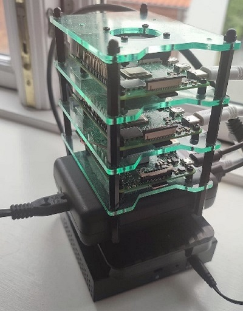

# Intro




# Table of content

- [Architecture](#Architecture)
- [Hardware](#Hardware)
- [Software](#Software)
- [Deployments](#Deployments)
- [Setup Steps](#Setup%20Steps)
- [Project Future](#Project%20Future)
- [Reference](#References)

# Architecture

[comment]: <> (Diagram)

[comment]: <> (2 Pis for Kubernetes cluster - cluster contains stateless applications, third pi used for Database, cloud instance &#40;stateful applications&#41;)

# Hardware

## Raspberry PI

The Raspberry Pi is a low cost, credit-card sized computer that plugs into a computer monitor or TV, and uses a standard
keyboard and mouse. It is a capable little device that enables people of all ages to explore computing, and to learn how
to program in languages like Scratch and Python. It’s capable of doing everything you’d expect a desktop computer to do,
from browsing the internet and playing high-definition video, to making spreadsheets, word-processing, and playing
games.


[comment]: <> (Brand, specs, number of pis)

## HDD Storage

[comment]: <> (External HDD mounted as a disk to the stateful appplication pi with the sharing enabled to the other two PIs)

## Ethernet switch

TP-Link Easy Smart TL-SG105E Switch 5-porte G


[comment]: <> (Brand, specs, capacity, price)

## WiFi Router

TP-Link TL-MR6400 4G LTE Router


[comment]: <> (TODO Convert the image )


[comment]: <> (Brand, specs, price type - SIM)

## Power supply

Anker PowerPort 63


[comment]: <> (It was possible to use POE technology &#40;Power Over Ethernet&#41; - didn't use due to the hats being expensive)

[comment]: <> (Into to why good power supply is important, brand, specs, price)

## Cables

[comment]: <> (List - Types, price length? )

## Cluster Case


[comment]: <> (Rack with cooling + added heat sinks on the PI chip - where to buy + price - aliexpress has rack usually
without fans)

# Software

## K3s Kubernetes distribution

K3s is a lightweight Kubernetes distribution created by Rancher Labs, and it is fully certified by the Cloud Native
Computing Foundation (CNCF). K3s is highly available and production-ready. It has a very small binary size and very low
resource requirements.

In simple terms, K3s is Kubernetes with bloat stripped out and a different backing datastore. That said, it is important
to note that K3s is not a fork, as it doesn’t change any of the core Kubernetes functionalities and remains close to
stock Kubernetes.


[K3S Official Website](https://rancher.com/docs/k3s/latest/en/)

Bundles following technologies to single distribution:

* [Containerd](https://containerd.io/) & [runc](https://github.com/opencontainers/runc)
* [Flannel](https://github.com/coreos/flannel) for CNI
* [CoreDNS](https://coredns.io/)
* [Metrics Server](https://github.com/kubernetes-sigs/metrics-server)
* [Traefik](https://containo.us/traefik/) for ingress
* [Klipper-lb](https://github.com/k3s-io/klipper-lb) as an embedded service load balancer provider
* [Kube-router](https://www.kube-router.io/) netpol controller for network policy
* [Helm-controller](https://github.com/k3s-io/helm-controller) to allow for CRD-driven deployment of helm manifests
* [Kine](https://github.com/k3s-io/kine) as a datastore shim that allows etcd to be replaced with other databases
* [Local-path-provisioner](https://github.com/rancher/local-path-provisioner) for provisioning volumes using local
  storage
* [Host utilities](https://github.com/k3s-io/k3s-root) such as iptables/nftables, ebtables, ethtool, & socat

[comment]: <> (Had other possibilities, but have chosen to use this distribution due to: easy installation, documentation and a lot of support )

[comment]: <> (What is, link, pros )

## Ansible

Ansible is a radically simple IT automation system. It handles configuration management, application deployment, cloud
provisioning, ad-hoc task execution, network automation, and multi-node orchestration. Ansible makes complex changes
like zero-downtime rolling updates with load balancers easy. More information on the Ansible website.


[comment]: <> (What was used for, link to repo with Ansible settings)

## Terraform

Terraform is a tool for building, changing, and versioning infrastructure safely and efficiently. Terraform can manage
existing and popular service providers as well as custom in-house solutions.

The key features of Terraform are:

* Infrastructure as Code: Infrastructure is described using a high-level configuration syntax. This allows a blueprint
  of your datacenter to be versioned and treated as you would any other code. Additionally, infrastructure can be shared
  and re-used.
* Execution Plans: Terraform has a "planning" step where it generates an execution plan. The execution plan shows what
  Terraform will do when you call apply. This lets you avoid any surprises when Terraform manipulates infrastructure.
* Resource Graph: Terraform builds a graph of all your resources, and parallelizes the creation and modification of any
  non-dependent resources. Because of this, Terraform builds infrastructure as efficiently as possible, and operators
  get insight into dependencies in their infrastructure.
* Change Automation: Complex change sets can be applied to your infrastructure with minimal human interaction. With the
  previously mentioned execution plan and resource graph, you know exactly what Terraform will change and in what order,
  avoiding many possible human errors.

### Reusable Modules

Terraform has been used in the project to automate provisioning of Kubernetes resources in the cluster. Due to this
reason, a reusable Terraform module has been developed in order to standardise and speed up Kubernetes deployments. The
following code snippet shows how the module can be used:

```
module "lil_linko_deployment" {
    source            = "../reusable-modules/full-deployment"
    health_check_path = "/healthcheck"
    image_tag         = "17"
    image_url         = "docker.io/tomondre/lil-linko"
    service_name      = local.lil_linko_host
    port              = 8080
    env               = {
        DATABASE_URL     = var.lil_linko_db_url
        HOST_URL         = "https://${local.lil_linko_host}.tomondre.com"
        ABSTRACT_API_KEY = var.lil_linko_abstract_api_key
    }
}
```

The module creates following resources in Kubernetes:

1. Kubernetes Deployment
2. Kubernetes Service
3. Cloudflare DNS record
4. Traefik Ingress Route for the DNS record

The data are given as an input to the module that uses it to create different resources. Common patterns between
applications needed to be found in order to create general, but also customizable module. Each stateless application has
the following attributes:

1. Health Check URL
2. Image tag
3. Image Url
4. Name of the application (Service)
5. Port of the app

Additionally, the module can be more customized by overwriting default values for: memory/cpu requests/limits, number of
replicas, namespace of the app, name of the DNS record.

### Cloud

Terraform Cloud has been chosen as a platform for storing the state of each module and for locking the Terraform state
to ensure state file consistency between deployments. Even though Terraform Cloud allows the Terraform commands to be
executed remotely in the cloud, it was not a requirement to do so, therefore the Terraform CLI was executed locally in
the private network


## Traefik

Traefik is a modern HTTP reverse proxy and load balancer that makes deploying microservices easy. Traefik integrates
with existing infrastructure components (Docker, Kubernetes, Consul, Etcd, Rancher, Amazon ECS, ...) and configures
itself automatically and dynamically. Pointing Traefik at orchestrator is the only configuration step needed.


```
apiVersion: traefik.containo.us/v1alpha1
kind: IngressRoute
metadata:
  name: portfolio
  namespace: default
spec:
  entryPoints:
  - websecure
  - web
  routes:
  - kind: Rule
    match: Host(`portfolio.tomondre.com`)
    services:
    - name: portfolio
      namespace: default
      port: 8080
```

[comment]: <> (Reverse proxy that proxies traffic to the correct kubernetes services based on the host header value of the request. This is the only endpoint exposed to the network - on ports 80 and 443 )

## CoreDNS

CoreDNS is a DNS server that is modular and pluggable, with plugins adding new functionalities. The CoreDNS server can
be configured by maintaining a Corefile, which is the CoreDNS configuration file. As a cluster administrator, you can
modify the ConfigMap for the CoreDNS Corefile to change how DNS service discovery behaves for that cluster.

```
tomondre.com:53 {
  errors
  rewrite name substring tomondre.com default.svc.cluster.local
}
```

## K9s Dashboard

K9s is a terminal-based UI to manage Kubernetes clusters that aims to simplify navigating, observing, and managing
applications in K8s. K9s continuously monitors Kubernetes clusters for changes and provides shortcut commands to
interact with the observed sources. This Open Source project is written in Go and has been in existence for almost 2
years: the first commit was made on February 1, 2019.


[comment]: <> (Intro to the tool, Observability, very powerful tool to see all resource within the cluster)

## CloudFlare Argo Tunnel

Cloudflare Tunnel is tunneling software that lets you quickly secure and encrypt application traffic to any type of
infrastructure, so you can hide your web server IP addresses, block direct attacks, and get back to delivering great
applications. The Tunnel daemon creates an encrypted tunnel between your origin web server and Cloudflare’s nearest data
center, all without opening any public inbound ports.


[comment]: <> (Problem CG NAT, solution, security, what technology is used, how is it connected to the Cloudfare network - long polling)

## MariaDB

MariaDB Server is one of the most popular database servers in the world. It’s made by the original developers of MySQL
and guaranteed to stay open source. Notable users include Wikipedia, DBS Bank, and ServiceNow.

The intent is also to maintain high compatibility with MySQL, ensuring a library binary equivalency and exact matching
with MySQL APIs and commands. MariaDB developers continue to develop new features and improve performance to better
serve its users.


[comment]: <> (Why has been chosen, connectivity - overall very good for the PIs)

## GitHub Actions Runner

[comment]: <> (TODO Check)

[GitHub Actions Demo](https://github.com/tomondre/celebrator-3000/blob/d65fe9dec15f01a6c166a71c92c56c48a83ca3b8/.github/workflows/github-actions.yml)

# Deployments


CronJob - Celebrator 3000 Contains RabbitMQ one node cluster - Maybe I can add this to the deployments page also
NextCloud Instance


[comment]: <> (Link to the page with all the deployments)

[comment]: <> (- [Deployments]&#40;https://deployments.tomondre.com&#41;)

# Setup Steps

* https://github.com/k3s-io/k3s-ansible

# Project Future

Add DNS records for the database More logging and add observability UI - Prometheus + ----- Add scaling rules to the
deployments Prometheus

# References

* https://im.cyberport.de/is/image/cyberport/151216092328900701900054D?$Zoom_1000$
* https://static.tp-link.com/TL-SG105E_UN_4.0_01_normal_1517903567595c.jpg
* https://i0.wp.com/raw.githubusercontent.com/traefik/traefik/master/docs/content/assets/img/traefik-architecture.png?w=810&ssl=1
* https://www.raspberrypi.org/help/what-%20is-a-raspberry-pi/
* https://github.com/hashicorp/terraform
* https://kubernetes.io/docs/tasks/administer-cluster/d